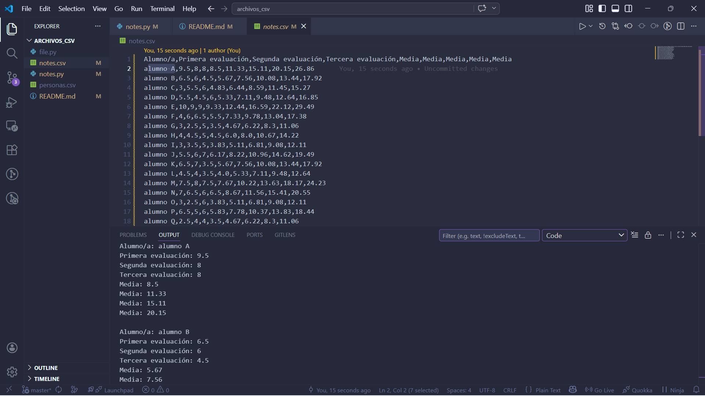

# CSV
- se guarda como texto plano, estructura en linea y valores separados por comas(o delimitadores). en python se ve como un conjunto de cadenas de texto (string) organizadas por difilas (listas, o tuplas). reflejando una estructura de tabla.

-  Usando el modulo csv , se lee como una lista de listas o una lista de diccionarios donde cada lista/diccionario representa una fila.

# Como se save internamente
- Texto plano, no tiene forma binaria ni estilos.

- En su Estructura, cada linea del archivo representa una fila de datos.

- Delimitadores, los valores dentro de cada fila se separan mediante comas( , ), tabuladores o punto y coma ( ; )

# Exmaple:

name, age, city
juan, 25, madrid

# Puntos claves
- newline = '': es crucial al abrir archivos, para evitar saltos de lineas adicionales.

# Pensamientos
- Al momento de trabajar con los datos en un for, recordar que se mueven como por filas y columnas, ejmplo [][] -> la primera es como si definiera las filas y la sefunda las columnas.

 

## File csv
- "r" → leer
Solo lectura
Error si no existe

- "w" → escribir
Escribe desde cero
BORRA todo lo anterior

- "a" → append (agregar)
Agrega al final
No borra nada

- "x" → crear
Crea archivo nuevo
Error si ya existe

# EXTRA
- "a+"  # leer + escribir
- "r+"  # leer + escribir (no crea archivo)
- newline="" -> Evita líneas en blanco extra

with open(ruta, mode="a", newline="", encoding="utf-8") as archivo:
  
  if incluir_header and not os.path.exists(ruta):
      writer.writerow(["nombre", "precio", "cantidad"])
